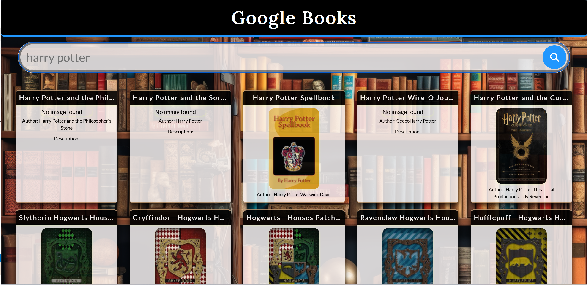
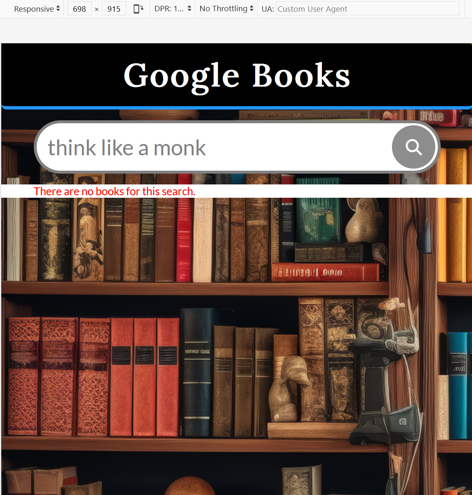
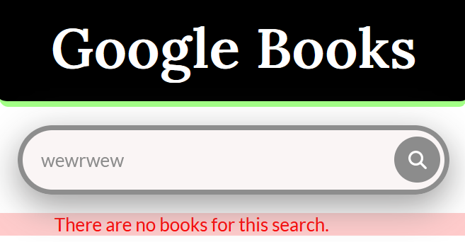

# Google Books

## **Table of Contents** 

  - [**Table of Contents**](#table-of-contents)
  - [**Description**](#description)
  - [**Functionality**](#functionality)
  - [**My experience**](#my-experience)
  - [**Technologies Used**](#technologies-used)
  - [**Preview**](#preview)
  - [**Deployed link**](#deployed-link)
  - [**Future Development**](#future-development)
  - [**Questions**](#questions)

## **Description**

This project was designed to interact with the Google Books API. This UI allows the user to search for books by typing the book's title or author, then the application fetches json data from the Google Books API returning and displaying an image, author, title and description (if they exist). 

The user can scroll down to see the complete book's description. In addition to the information described, the user can click the book card and a modal is displayed with some more information such as: lenguage, published date, publisher name, page count and average rating.  

## **My experience**

Fetching data from an API is kind of a game, as different scenarios can occur. I got a 429 error which made it a bit hard to understand what was happening. The docs did not made it clear what the issue was, then after a while I found out that I needed to get a API key to fetch data from the Google Books API as an individual user rather than a public user due to Google's daily rate limiting.

For this project I went with a pinch of vivid colour to make a change from the colours that I usually choose.
The coulor palette here: https://colorhunt.co/palette/164b601b6b934fc0d0a2ff86

## **Functionality**
- Search the book by Title or Author.
- Find more information by clicking each book.
- Scroll down on each book card to be able to read all the book's description.

## **Technologies Used**

* HTML
* Sass/Scss
* CSS
* JavaScript
* React

## **Preview**

* **Desktop Mode**

* **Mobile Mode**

* **Tablet Mode**

* **Error**

## **Deployed link**

💡 Live version: [Click here!](https://marcelamejiao.github.io/Google-Books/)

## **Future Development**

* Pagination every 10 books.

## **Questions**

* Contact me on my GitHub profile: [Marcela's GitHub](https://github.com/marcelamejiao)
